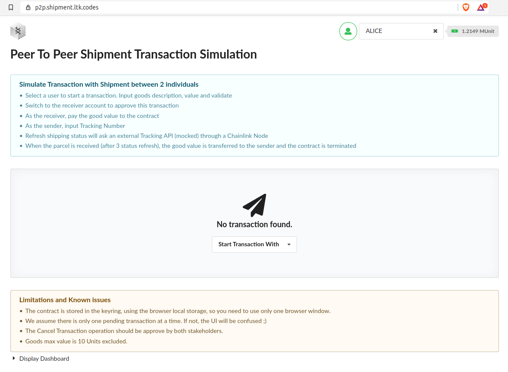
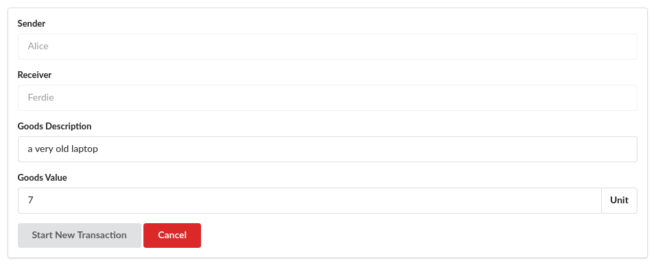
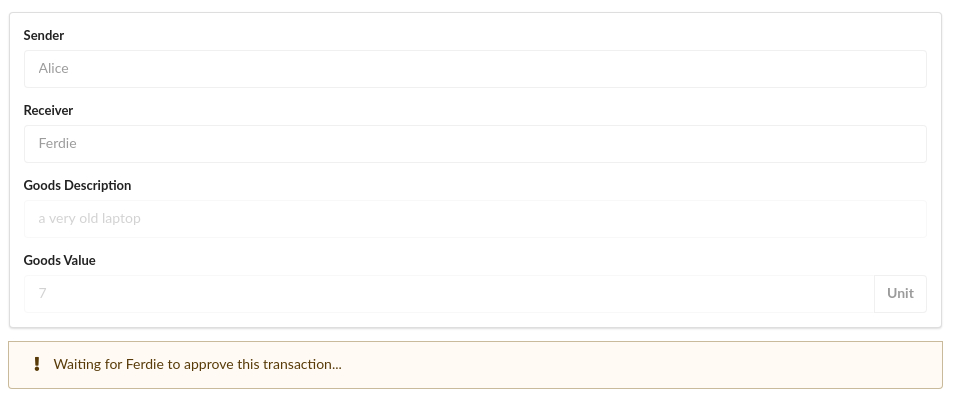
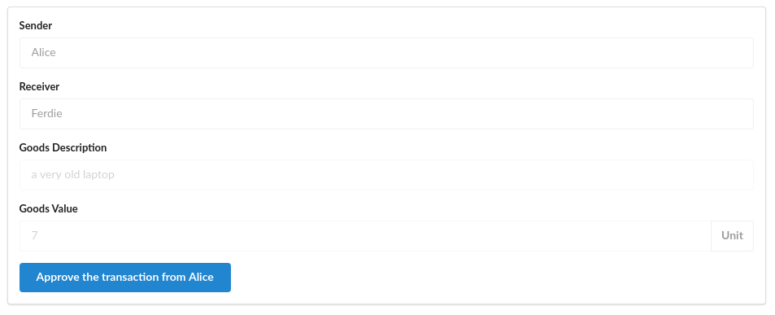
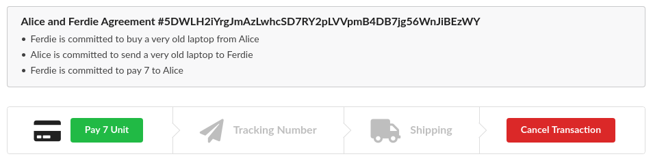
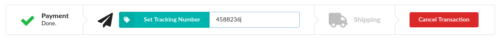
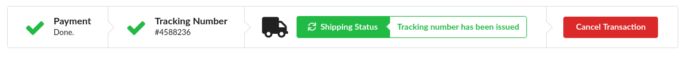

# P2P Shipment Transaction dApp

See https://gitcoin.co/issue/Polkadot-Network/hello-world-by-polkadot/2/100023928

This dApp is a simulation where 2 people deploy an !Ink Contract engaging them in a transaction :
- Sender is committed to send some goods to the receiver
- Receiver is committed to pay the sender the goods value stored in the contract
- The goods values is being transferred to the sender when shipment status indicate that the parcel is received

The contract is deployed only when both stakeholders approve the contract creation (multi signatures transaction).  
The shipment status is retrieved from a Chainlink Oracle, using Chainlink External Initiator and Substrate Adapter. Both components have been updated to be used from an Ink contract.   

> The runtime doesn't need the Chainlink Pallet, the necessary event is generated from the contract itself.  
> The shipment tracking external adapter is mocked.

**How it works:**
- You can play with the dApp at https://p2p.shipment.ltk.codes

- Select a user to start a transaction. Input goods description, value and validate

- The transaction needs to be approved by the receiver

- Switch to the receiver account to approve this transaction

- As the receiver, pay the good value to the contract

- As the sender, input Tracking Number

- Refresh shipping status will ask an external Tracking API (mocked) through a Chainlink Node

- When the parcel is received (after 3 status refresh), the good value is transferred to the sender and the contract is terminated

**Limitations and Known issues**
- The contract is stored in the keyring, using the browser local storage, so you need to play with a single browser instance.
- We assume there is only one pending transaction at a time. If not, the UI will be confused ;)
- The Cancel Transaction operation should be approved by both stakeholders.
- Goods max value is 10 Units excluded.
