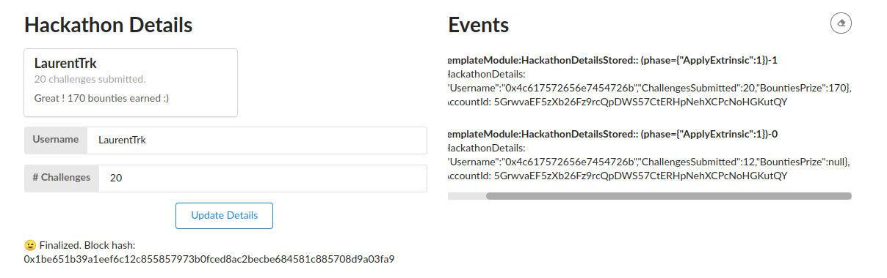

#[INTERMEDIATE CHALLENGE] FRAME Development

See https://gitcoin.co/issue/Polkadot-Network/hello-world-by-polkadot/7/100023933

- Get the [node](https://github.com/substrate-developer-hub/substrate-node-template) and [front-end](https://github.com/substrate-developer-hub/substrate-front-end-template) from substrate templates
- Add a custom structure to play with in the Template Pallet:
```rust
pub struct HackathonDetails {
	username: Vec<u8>,
	challenges_submitted: u32,
	bounties_prize: Option<u32>,
}
```
- Add the corresponding storage and the `update_hackathon_details` function to update this storage.
- Optional bounties are triggered when 18 challenges or more are submitted
- Add some unit tests
- Update custom types to front-end
- Add new front-end component to play with the hackathon details



