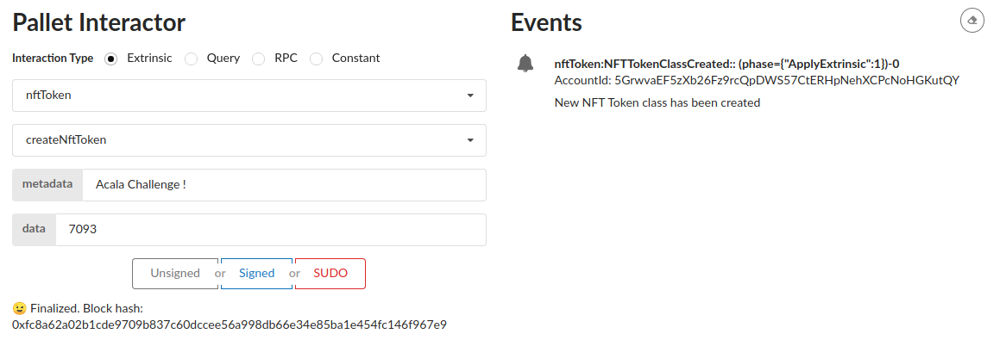
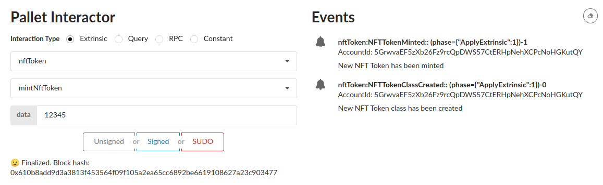
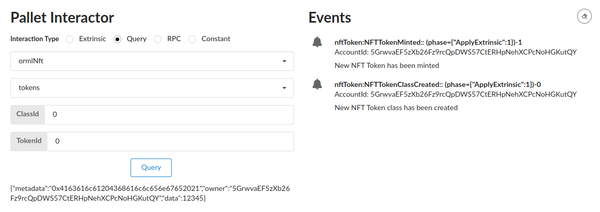

# Enable NFT Support 

See https://gitcoin.co/issue/AcalaNetwork/polakdot-hello-world-acala/1/100023951

**What has been done:**
- Get the [node](https://github.com/substrate-developer-hub/substrate-node-template) and [front-end](https://github.com/substrate-developer-hub/substrate-front-end-template) from substrate templates
- Add the [orml-nft pallet](https://github.com/open-web3-stack/open-runtime-module-library/tree/master/nft) to the node runtime
- Create a new pallet nft-token that use the orml-nft
- Add 2 functions, one to create a new NFT Token class and another to mint a token
- Add the missing types to the front-end
- Play with the pallet interactor to create a new NFT Token class and mint it

**Create new NFT Token class using the NFT Token Pallet**

The class ID and metadata are stored in the NFT Token Pallet.  
Class ID is 0 as it is the first class issued.

**Mint a new Token**

Token ID is 0 as it is the first token issued.
**Check that the token has been issued**

