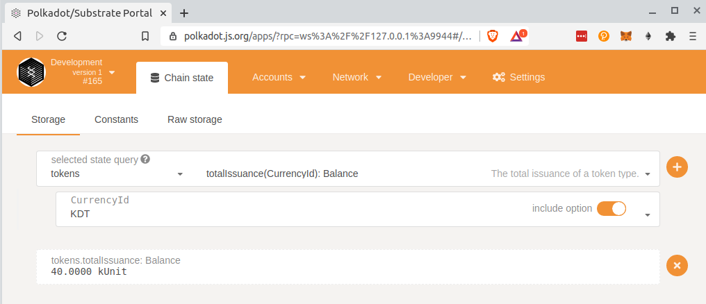
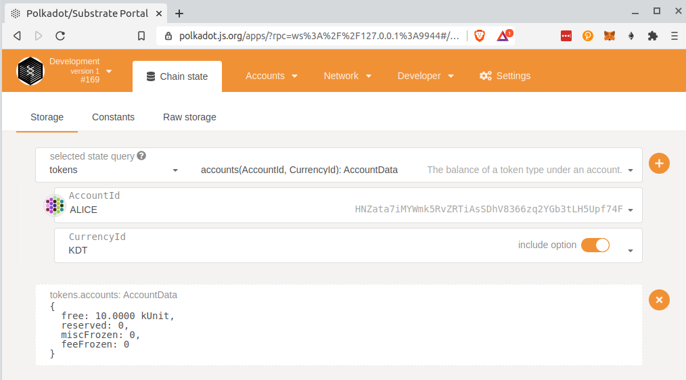

# Enable Multi-currency Support

See https://gitcoin.co/issue/AcalaNetwork/polakdot-hello-world-acala/2/100023952

**What has been done:**
- Get the [node](https://github.com/substrate-developer-hub/substrate-node-template) and [front-end](https://github.com/substrate-developer-hub/substrate-front-end-template) from substrate templates
- Add the [orml-tokens pallet](https://github.com/open-web3-stack/open-runtime-module-library/tree/master/tokens) to the node runtime
- Use 4 types of currencies:
```rust
pub enum CurrencyId {
	KDT,    // Custom token :)
	DOT,
	KSM,
	BTC,
}
```
- Change the chain genesis to issue KDT and DOT tokens to endowed accounts
- Add the missing types to the **polkadot-js/apps** [developer settings](https://polkadot.js.org/apps/?rpc=ws%3A%2F%2F127.0.0.1%3A9944#/settings/developer)
- Use **polkadot-js/apps** to check that tokens have been issued


