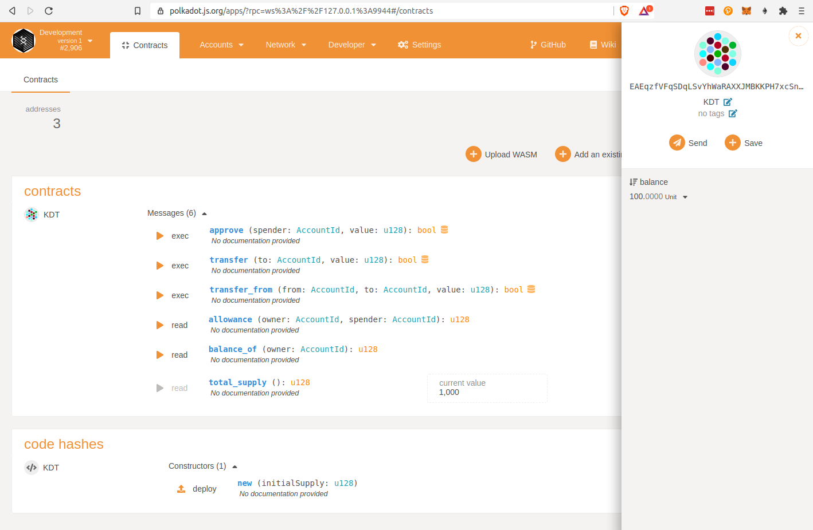
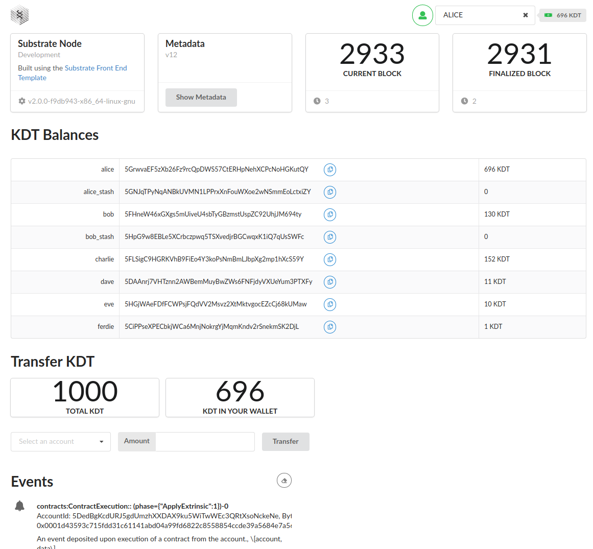

# Creating a new ERC20 contract

See https://gitcoin.co/issue/Polkadot-Network/hello-world-by-polkadot/9/100023935

As an example, I chose to create a new contract for a token name **KDT**.  
The **KDT** token stands for the Ki.Dot token, used in the [Ki.Dot Project](https://ki.dot.ltk.codes/#/).

**What has been done:**
- Get the [node](https://github.com/substrate-developer-hub/substrate-node-template) and [front-end](https://github.com/substrate-developer-hub/substrate-front-end-template) from substrate templates
- Add the Contracts pallet using [this tutorial](https://substrate.dev/docs/en/tutorials/add-contracts-pallet/)
- Create the new contract **KDT** using the [Erc20 sample](https://github.com/paritytech/ink/tree/master/examples/erc20)
- Test and compile the contract (See https://substrate.dev/substrate-contracts-workshop/#/)
- Deploy the contract and check everything is fine using the [polkadot.js/apps](https://polkadot.js.org/apps/?rpc=ws%3A%2F%2F127.0.0.1%3A9944#/contracts)

- Add the `@polkadot/api-contract` dependency to the front-end
- Using Balances and Transfer component as example, create `KdtTransfer` and `KdtBalances` component, using the KDT deployed contract
- Update the main front end page to display KDT balances and transfer components
- Update the account selector component to display current balance in KDT.
- Play with the new ui :)

