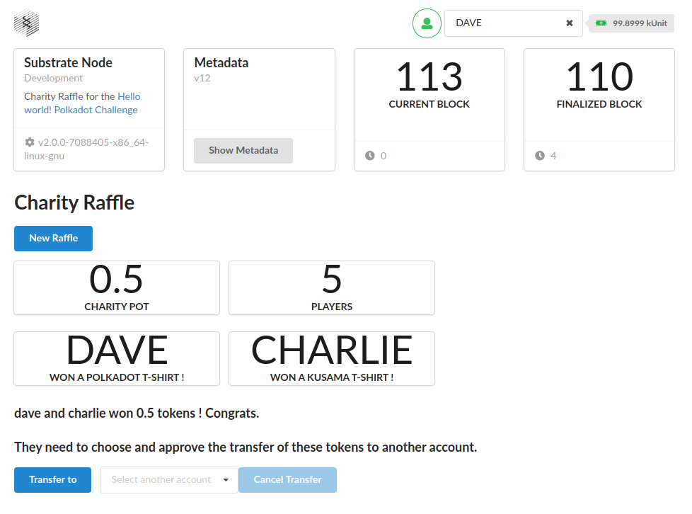
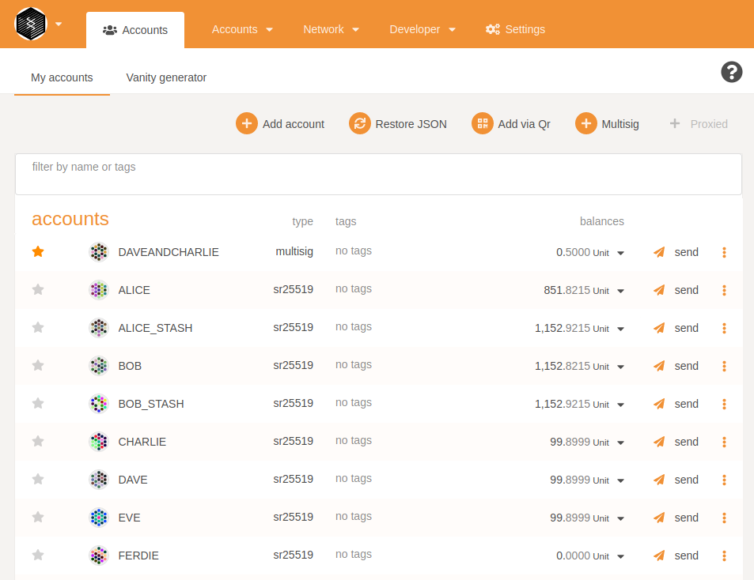
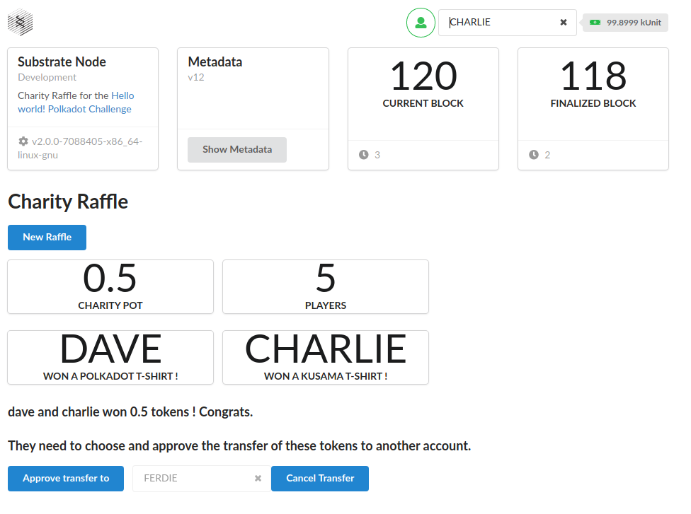
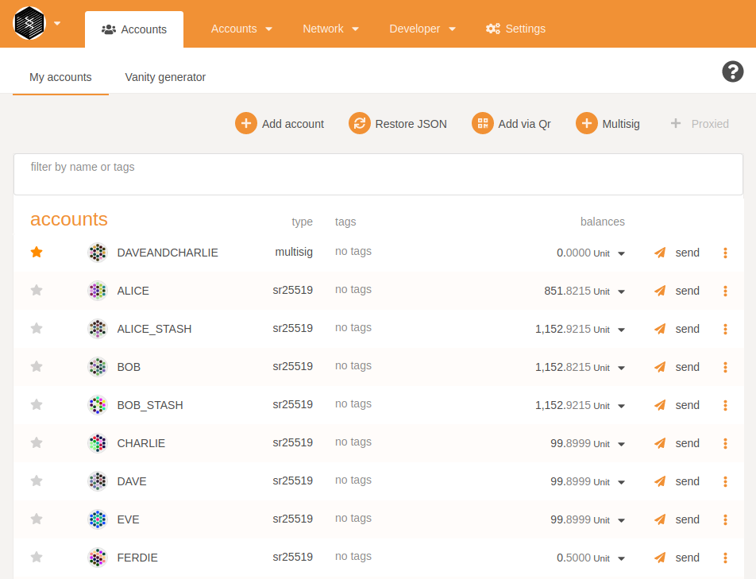
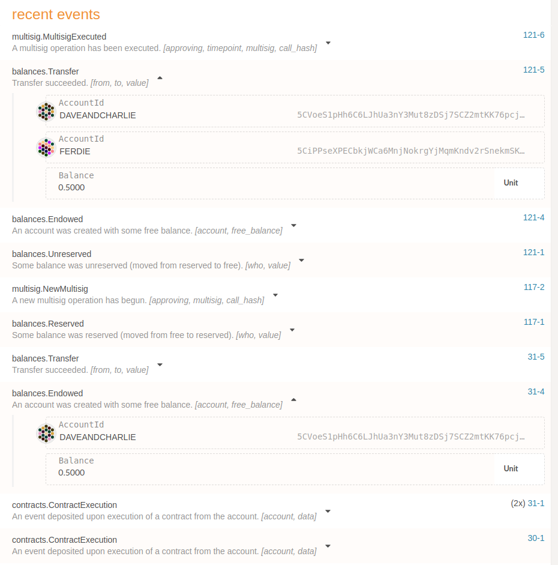

# FRAME Multisig

See https://gitcoin.co/issue/Polkadot-Network/hello-world-by-polkadot/8/100023934

I used the previous challenge 'Build a charity Raffle' to implement a multisig transaction :
- when the 2 winners are selected, the contract transfers the funds to the multisig account of the 2 winners
- they need to choose and approve the transfer of the funds they have received collectively, to another account, engaging them in a multisig transaction

**What has been done:**
- Get the previous contract and ui for the charity raffle challenge
- Change the contract to remove the charity account parameter
- On winners selection, build the multisig account and transfer funds to this account
- Build and deploy this new contract
- Add the `multisig` pallet to the node runtime
- Change the Charity Raffle UI Component to remove charity account
- Add multisig transfer call to the Charity Raffe UI Component
- Play with the new ui :)
- When the raffle is closed, the winners need to choose another account to transfer funds :

- Charlie and Dave won, their multisig account has been funded :

- Dave choose to transfer to Ferdie, Charlie needs to approve the transfert :

- When the transfert is approved, the winning pot balance is transfered from DaveAndCharlie account to Ferdie

- We can check all the transactions in the events list:

