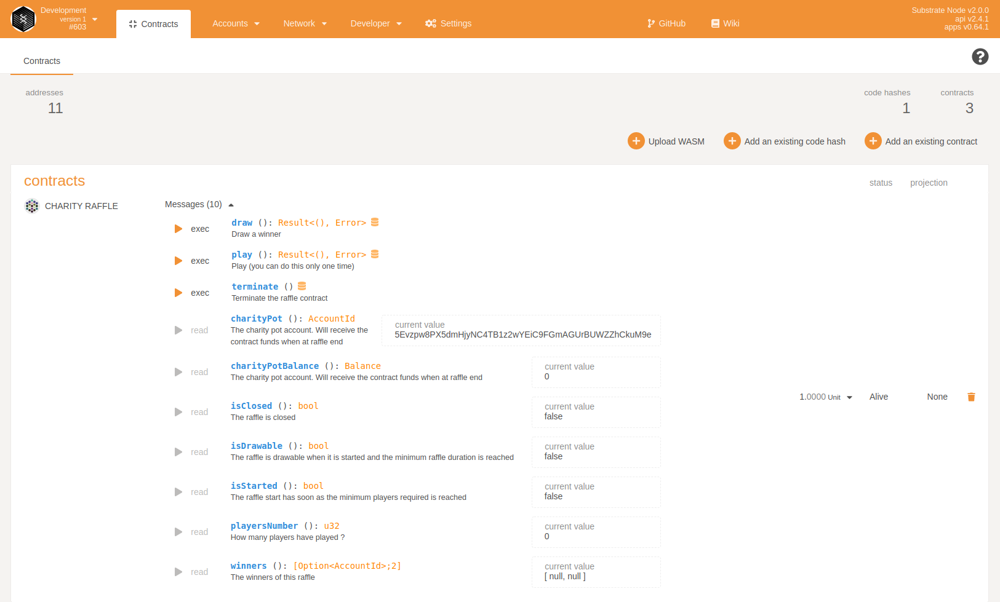
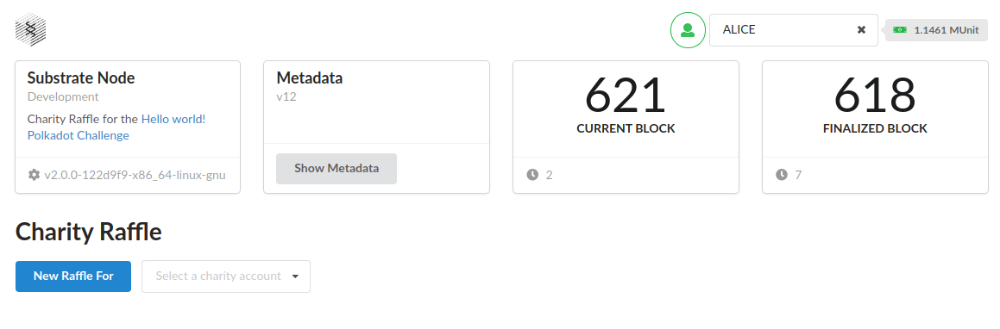
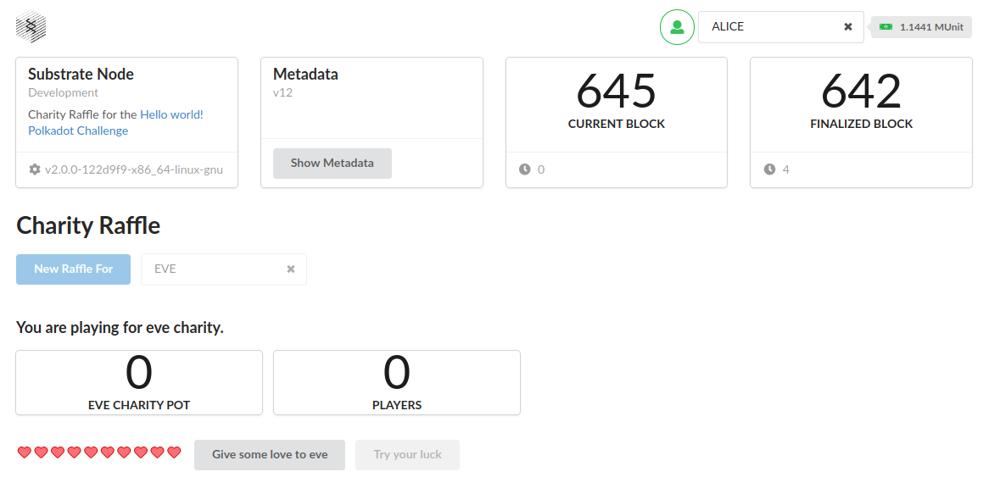
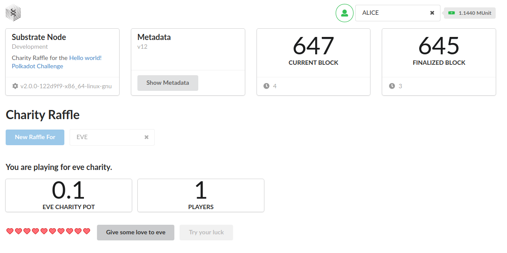
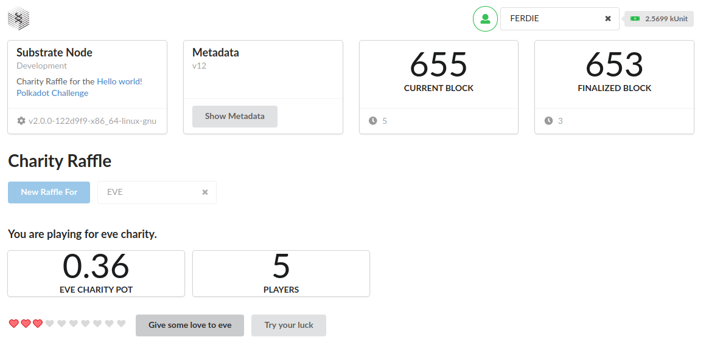
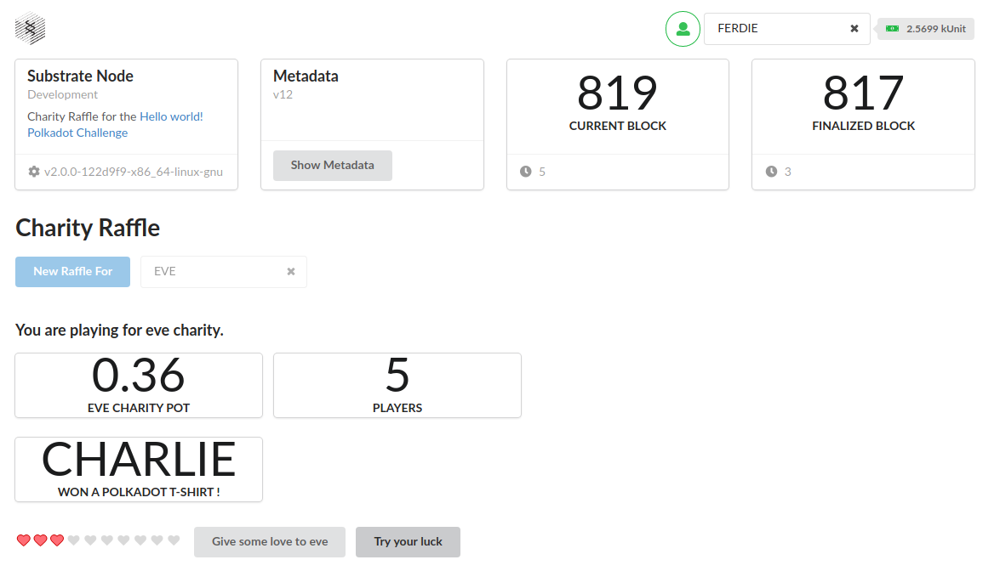
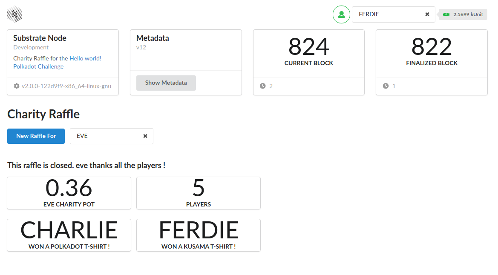

# Build A Charity Raffle with an Ink contract

https://gitcoin.co/issue/Polkadot-Network/hello-world-by-polkadot/3/100023929

**What has been done:**
- Get the [node](https://github.com/substrate-developer-hub/substrate-node-template) and [front-end](https://github.com/substrate-developer-hub/substrate-front-end-template) from substrate templates
- Add the Contracts pallet using [this tutorial](https://substrate.dev/docs/en/tutorials/add-contracts-pallet/)
- Create a first simple version of the Charity Raffle contract, with the help of [this video](https://www.crowdcast.io/e/ethereum-apps-moonbeam)
- Add some unit tests and start validating the contract until everything is fine
- Deploy the contract and start playing with it using the [polkadot.js/apps](https://polkadot.js.org/apps/?rpc=ws%3A%2F%2F127.0.0.1%3A9944#/contracts)

- Add the `@polkadot/api-contract` dependency to the front-end
- Create the Charity Raffle UI component to use an already deployed contract
- Enhance the Charity Raffle UI to add contract deployment
- Play with the new ui :)
- Click on **New Raffle For** to deploy the Charity Raffle Contract :

- Choose amount and play :

- First player has played :

- All players have played :

- After 15 minutes, first winner has been selected :

- When the 2nd winner is selected, the raffle is close :

