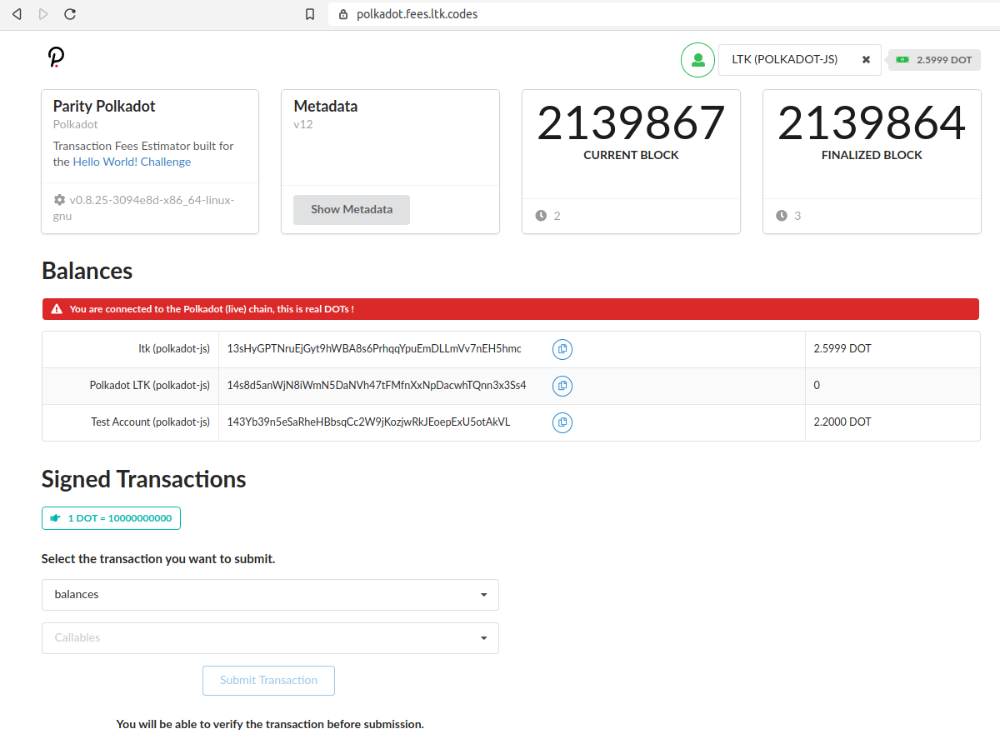
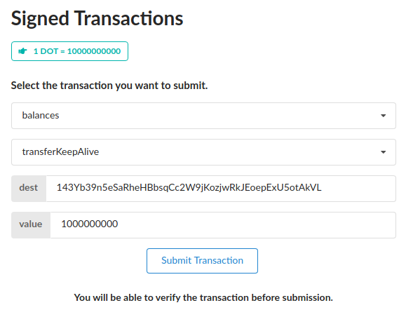
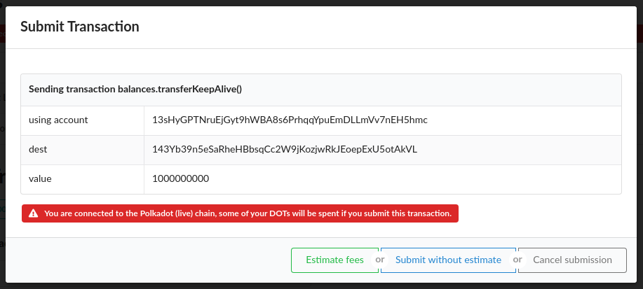
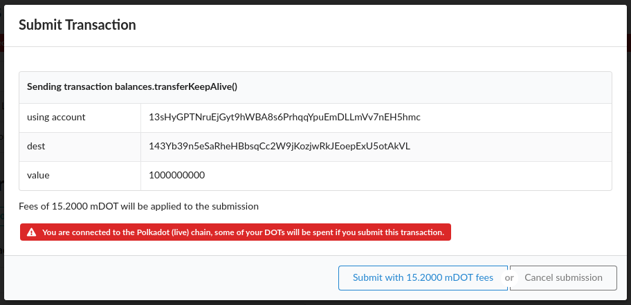

# Build A Transaction Fee Estimator

See https://gitcoin.co/issue/Polkadot-Network/hello-world-by-polkadot/4/100023930

**What has been done:**
- Get the [front-end](https://github.com/substrate-developer-hub/substrate-front-end-template) from substrate templates
- Get the [sidecar](https://github.com/paritytech/substrate-api-sidecar) sources and build a Docker image of it
- Run a sidecar instance connected to a local node
- Play with the sidecar api to get some estimates
- Hack the `txButton` component to add ESTIMATE button
- Look at the [paymentInfo](https://github.com/polkadot-js/api/blob/2b1438030bb438c3bc85d16dcf638eb8f98d9ee6/packages/api/src/submittable/createClass.ts) method to see how fake sign a transaction
- Using the pallet interactor component as an example, code a `signedTransactions` component providing a modal confirmation box with estimate fees
- Clean up the general view 
- Build a Dockerfile of the front end
- Put all together with a NGINX reverse proxy to get rid of CORS issues
- Go live on https://polkadot.fees.ltk.codes/ :)

**Some screenshots**

_Main view_

_Select a transaction with the Signed Transactions component:_

_Submission confirmation box:_

_Submission confirmation box with fees estimate:_

